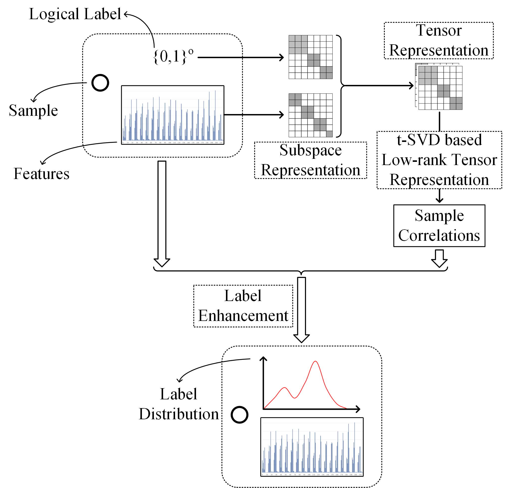

# gLESC
Source codes of "Generalized Label Enhancement with Sample Correlations" pubilished in IEEE TKDE 2021

If you find the codes useful in your research, please cite our work as follows, thanks.

@article\{gLESC2021, 
      &nbsp;&nbsp;&nbsp;&nbsp;title=\{Generalized Label Enhancement with Sample Correlations\}, 
      &nbsp;&nbsp;&nbsp;&nbsp;author=\{Zheng, Qinghai and Zhu, Jihua and Tang, Haoyu and Liu, Xinyuan and Li, Zhongyu and Lu, Huimin\}, 
      &nbsp;&nbsp;&nbsp;&nbsp;journal=\{IEEE Transactions on Knowledge and Data Engineering\}, 
      &nbsp;&nbsp;&nbsp;&nbsp;year=\{2021\}, 
      &nbsp;&nbsp;&nbsp;&nbsp;doi=\{10.1109/TKDE.2021.3073157\} 
\} 

Email: zhengqinghai@stu.xjtu.edu.cn

